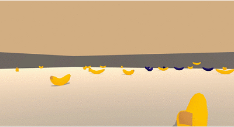

# dqn-navigation
Deep Reinforcement Learning - Project dedicated to train an agent to navigate.

This project is part of the **Deep Reinforcement learning NanoDegree - Udacity**

# The Environment
The main goal of this project is to train an agent to navigate (and collect bananas!) in a large, square world.

A reward of +1 is provided for collecting a yellow banana, and a reward of -1 is provided for collecting a blue banana. Thus, the goal of the agent is to collect as many yellow bananas as possible while avoiding blue bananas.

The state space has 37 dimensions and contains the agent's velocity, along with ray-based perception of objects around the agent's forward direction. Given this information, the agent has to learn how to best select actions. Four discrete actions are available, corresponding to:

> - 0 - move forward.
> - 1 - move backward.
> - 2 - turn left.
> - 3 - turn right.

The task is episodic, and in order to solve the environment, the agent must get an **average score of +13 over 100 consecutive episodes**.

# Python environment

(source: Udacity Deep Reinforcement Learning NanoDegree)

To set up your python environment to run the code in this repository, follow the instructions below.

1. Create (and activate) a new environment with Python 3.6 (named **drlnd** or the name of your choice).
   - Linux or Mac:
     > Conda create --name drlnd python=3.6  
     > source activate drlnd
   - Windows:
     > conda create --name drlnd python=3.6  
	 > activate drlnd

2. If not already done, clone the current repository and navigate to the root folder. Then install required dependencies.
	> git clone https://github.com/ablou1/dqn-navigation.git  
	> cd dqn-navigation  
	> pip install -r requirements.txt

3. Install Pytorch & Cuda
	> conda install pytorch torchvision cudatoolkit=10.1 -c pytorch

4. Clone the udacity/deep-reinforcement-learning repository (outtside the current project) and navigate to the python/ folder. Then, install several dependencies.
	> git clone https://github.com/udacity/deep-reinforcement-learning.git  
	> cd deep-reinforcement-learning/python  
	> pip install .

5. Create an [IPython kernel](https://ipython.readthedocs.io/en/stable/install/kernel_install.html) for the drlnd environment.
	> python -m ipykernel install --user --name drlnd --display-name "drlnd"

6. Before running code in a notebook, change the kernel to match the drlnd environment by using the drop-down Kernel menu.

# Download the Environment
To use this repository, you do not need to install Unity. You can download the environment from one of the links below. You need only select the environment that matches your operating system:
- Linux: [click here](https://s3-us-west-1.amazonaws.com/udacity-drlnd/P1/Banana/Banana_Linux.zip)
- Mac OSX: [click here](https://s3-us-west-1.amazonaws.com/udacity-drlnd/P1/Banana/Banana.app.zip)
- Windows (32-bit): [click here](https://s3-us-west-1.amazonaws.com/udacity-drlnd/P1/Banana/Banana_Windows_x86.zip)
- Windows (64-bit): [click here](https://s3-us-west-1.amazonaws.com/udacity-drlnd/P1/Banana/Banana_Windows_x86_64.zip)

Then, place the file in the root of this repository, and unzip (or decompress) the file.

(For Windows users) Check out [this link](https://support.microsoft.com/en-us/help/827218/how-to-determine-whether-a-computer-is-running-a-32-bit-version-or-64) if you need help with determining if your computer is running a 32-bit version or 64-bit version of the Windows operating system.

(For AWS) If you'd like to train the agent on AWS (and have not [enabled a virtual screen](https://github.com/Unity-Technologies/ml-agents/blob/master/docs/Training-on-Amazon-Web-Service.md)), then please use [this link](https://s3-us-west-1.amazonaws.com/udacity-drlnd/P1/Banana/Banana_Linux_NoVis.zip) to obtain the "headless" version of the environment. You will **not** be able to watch the agent without enabling a virtual screen, but you will be able to train the agent. (To watch the agent, you should follow the instructions to [enable a virtual screen](https://github.com/Unity-Technologies/ml-agents/blob/master/docs/Training-on-Amazon-Web-Service.md), and then download the environment for the Linux operating system above.)

# Agents
This repository contains four type of agent that could be trained:
- **DqnAgent** : Use a "classical" DqnAgent algorithm
- **DoubleDqnAgent**: DqnAgent adding the Double DQN technic
- **DuelingDqnAgent**: DqnAgent adding the Dueling DQN technic
- **DuelingDoubleDqnAgent**: DqnAgent adding both Dueling and Double DQN technics.

# Train (single run)
The train.py file is dedicated to run a single train of a specified agent.

1. Update the file_name of the UnityEnvironment in order to match the location of the Unity environment that you downloaded.
- Mac: "path/to/Banana.app"
- Windows (x86): "path/to/Banana_Windows_x86/Banana.exe"
- Windows (x86_64): "path/to/Banana_Windows_x86_64/Banana.exe"
- Linux (x86): "path/to/Banana_Linux/Banana.x86"
- Linux (x86_64): "path/to/Banana_Linux/Banana.x86_64"
- Linux (x86, headless): "path/to/Banana_Linux_NoVis/Banana.x86"
- Linux (x86_64, headless): "path/to/Banana_Linux_NoVis/Banana.x86_64"

	For instance, if you are using a Mac, then you downloaded Banana.app. If this file is in the same folder as the notebook, then the line below should appear as follows:
	> env = UnityEnvironment(file_name="Banana.app")

2. Allocate the good agent class depending on the agent you want to train to the agent variable. The inputs parameter are the same for all kind of agent. Feel free to modify this parameter in order to make tests.

3. Run the training process by executing the following command :
	> python train.py

	It automatically create a checkpoint file with the following name format ({agent_name}_checkpoint.pth). You can display your agent to see him performing with the display procedure.

# Display an agent
The display_agent.py is dedicated to display an agent playing the game.

1. Update the AGENT_CLASS with the class name of the agent you want to display. (You must have succeed the training step before using this display mode). The repository contains the checkpoint file of each algorithm. You can already display all of them.

2. Display the game
	> python display_agent.py

# Train (compare parameter and agents)
The **Training Analysis.ipynb** notebook is dedicated to compare different parameterization of the agent training and also to compare different classes of agents.

## Training part
You can define the number of episodes allocated for each training process. 

1. The first subpart is dedicated to test parameters. You just have to indicate the values you want to test. Take care of the calculation time. After each training, a file save the result in order to display graph at the end of the notebook. No checkpoint file are saved in this part.

2. The second part is dedicated to the agent class comparison. One training is executed for each class with the same parameters (you can change this values). If the agent succeed (having an average score higher than 13 on 100 following episodes), a checkpoint is created for that agent. You can also display it (cf. previous part).

## Results analysis
This part shows graph comparing different attributes values and different agents.

## checkpoint.pth format
The checkpoint.pth file contains a dictionary with the following informations:
> - 'state_size': the state size of the environment during the training,
> - 'action_size': the action size of the environment during the training,
> - 'hidden_layer_size': the size of hidden layers used in the model. There are Two hidden layers both with the same size.
> - 'state_dict': the state_dict of the network trained for the agent who succeed.

the checkpoint.pth file correspond to the DuelingDoubleDqnAgent_checkpoint.pth file