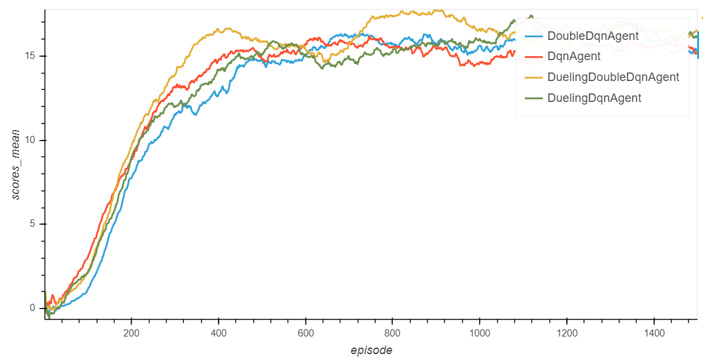

# dqn-navigation report  

## Learning Algorithm

This repository compare 4 different algorithms :
> - Deep Q-Learning Algorithm (DqnAgent)
> - Double DQN (DoubleDqnAgent)
> - Dueling DQN (DuelingDqnAgent)
> - Dueling Double DQN (DuelingDoubleDqnAgent)

For now, the one which got the best results is the Dueling Double DQN.

The network used for these algorithms is the following.  
> For the DqnAgent and DoubleDqnAgent
> - The input Layer (State_Size)
> - Two fully connected layers (Hidden_Layer_size)
> - The output Layer (Action_size)
> - The Relu function is used before the two hidden layers
> - The optimizer is the Adam one
> - The mse is used for the loss function   

> For the DuelingDqnAgent and the DuelingDoubleDqnAgent the network is nearly the same.
> - The input Layer (State_Size)
> - Two fully connected layers (Hidden_Layer_size)
> - The output Layer (Action_size)
> - The Relu function is used before the two hidden layers and the last but one level
> - A fully connected layer named advantage has been added. It is connected to the last "hidden" layer. (Action size)
> - A fully connected layer named value has also been connected to the last "hidden" layer. (size = 1)
> - The final layer is the sum of the value layer + the advantage one - the mean of the advantage one.
> - The optimizer is the Adam one
> - The mse is used for the loss function 

Note that the hidden_layer_size selected is 32 (see below)

Here is the des cription of the tests realized. A two step analysis has been done.

1. Parameter selection  
Using the Deep Q-learning Algorithm, the aim was to find a good parameterization. The agent has been trained by changing one parameter at a time. Two main criteria were used to compare the results :  
    - The number of episodes needed to succeed
	- The best average score on 100 following games (during the 2000 episodes process)

	First of all, the different values tested to each parameter didn't change significantly the results. eps_decay is probably the most impacting one. We compared the following values [**0.98**, 0.99, 0.995]. The 0.98 value speed up the algorithm.
	For the other parameter, we tested the following values. You find in bold the selected one (either because it speed up the algorithm or help to get the best score)
	- gamma : [0.95, 0.975, **0.99**]
	- update_every : [**4**, 8]
	- hidden_layer_size : [**32**, 64]
	- batch_size : [**32**, 64, 128]
	- tau : [**1e-3**, 0.005, 0.01]

2. Algorithms comparison  
Then, the four algorithms were trained with the parameters selected at the previous step on 1500 episodes. All of them succeed in less than 310 episodes. The fastest one to succeed was the Dueling Double DQN Algorithm with **176 episodes** (The average score between the 176 and 275 episode was higher than 13). It also got the best average score (**17.76**). (See the plot of rewards below).

## Plot of Rewards
This graph represents the average score on the 100 previous epoques of each algorithm.

## Ideas for Future Work
Several ideas could be tested for future works.
> - Automatize the parameter selection for each algorithm instead of testing arbitraries values.
> - Test new algorithms like the rainbow approach from google.
> - Learn directly from the pixels.